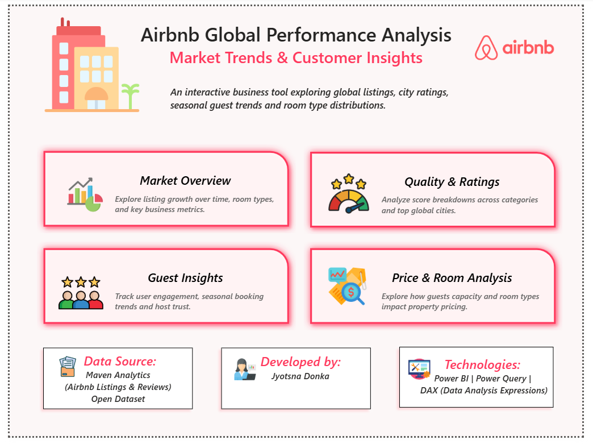
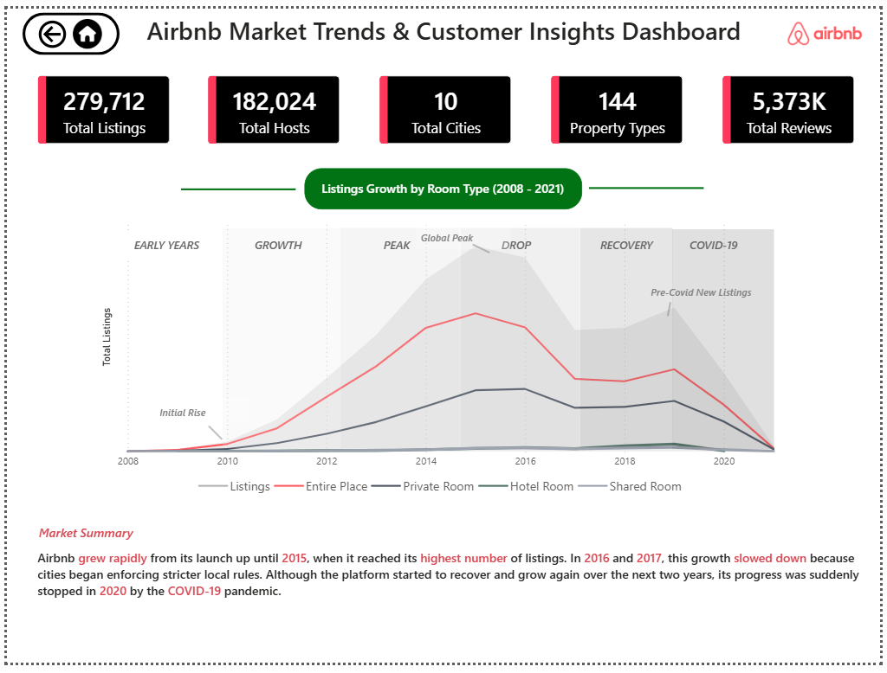
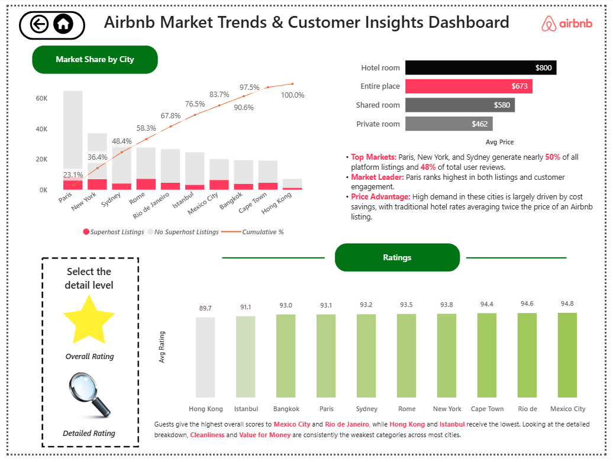
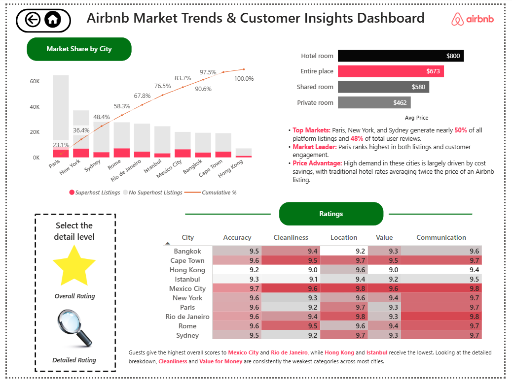
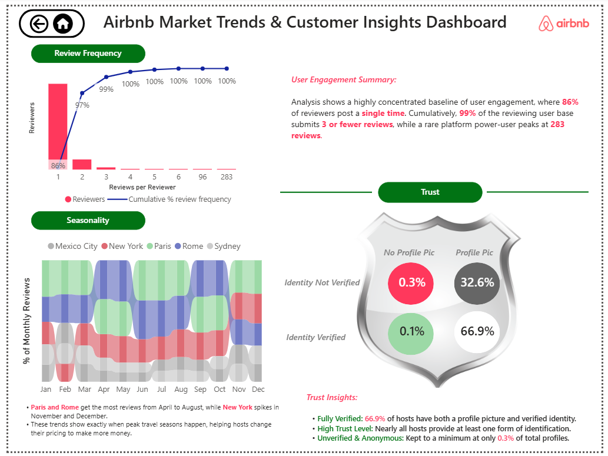
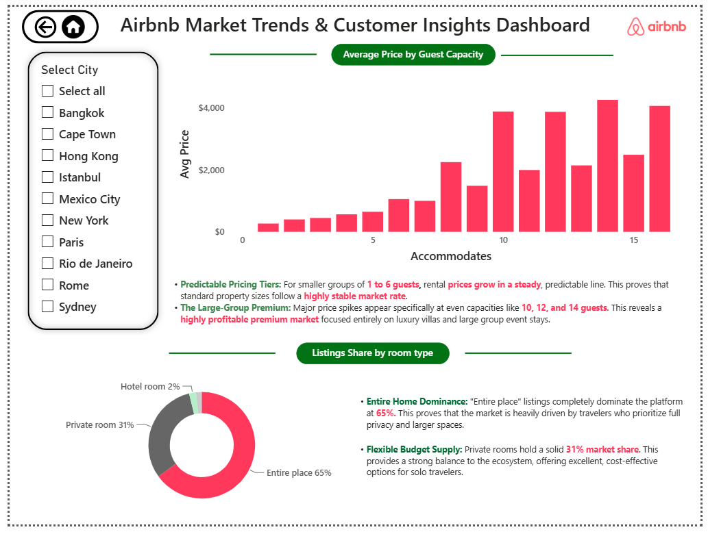

# Airbnb-Market-Performance-Analysis (Power BI)
An interactive Power BI dashboard analyzing global hospitality market trends, pricing structures, and customer insights. Built with advanced DAX modeling and clean data transformations to serve as an executive business intelligence tool.

# Airbnb Global Performance Analysis Dashboard

## 📊 Dashboard & Project Access

- **🚀 Live Interactive Dashboard:** [View Live Report Here](https://app.powerbi.com/view?r=eyJrIjoiZmZlOGZkMGMtNWY2Zi00NGQ3LWEzNzQtMDZjNjU1MDM2ODU1IiwidCI6ImRkM2U0NjExLWJlMjktNDg2ZC05ODdkLTViYjE2NzEwZjBhZCJ9)
- **🎬 Presentation & Walkthrough Video:** [Watch Video Here](https://www.linkedin.com/posts/djyotsna09_dataanalytics-businessintelligence-powerbi-ugcPost-7477611871173369856-EIwZ/?highlightedUpdateUrn=urn%3Ali%3Aactivity%3A7477612054254682112&origin=SOCIAL_SHARE&utm_source=share&utm_medium=member_desktop&rcm=ACoAAFHnFNAB_uork4dUr-h6feRmQup2pOVDcxE)
- **💾 Open-Source Dataset:** [Access Maven Analytics Dataset Here](https://mavenanalytics.io/data-playground/airbnb-listings-reviews)

---

## 📸 Executive Dashboard Landing Page

---
## 📌 Problem Statement
Raw hospitality marketplace data containing over 250,000 global short-term rental listings and 5 million historical reviews presents a critical barrier for stakeholders: without a unified business intelligence layer, core operational metrics remain trapped in data silos. Marketplace managers and real estate investors struggle to isolate localized supply anomalies, identify critical property price drivers, map seasonal consumer interest waves, or evaluate cross-city travel value accurately. 

This project bridges that business gap by directly answering the foundational challenge questions proposed by Maven Analytics and scaling the dashboard architecture into a custom, data-driven pricing optimization platform.

---
## 📋 Recommended Tasks, Applied Solutions & Visualizations

Before diving into granular questions, the analysis establishes a global macro-context baseline to view the entire scope of the dataset:

### 🌐 Macro-Context: Global Market Scale & Timeline Analysis
* **The Business Purpose:** Before answering specific localized questions, a business stakeholder must understand the historical timeline baseline. This page functions as the macro-narrative, tracking how the global platform scaled and identifying market shocks.
* **The Applied Solution & Data Narrative:** Developed a historical timeline tracking total supply growth from launch through 2021. The visualization successfully isolates distinct macroeconomic phases: rapid expansion from launch until the **2015 global peak**, a deliberate structural slowdown during **2016–2017** as cities began enforcing stricter local regulations, a brief market recovery, and a sudden marketplace halt in **2020** driven by the global COVID-19 pandemic.

#### 📊 Market Overview Visualization:

---
### 1. Cross-City Market Variance Mapping & 4. Travel Value Optimization
* **The Business Challenges:** *Can you spot any major differences in the Airbnb market between cities?* & *Which city offers a better value for travel?*
* **The Applied Solution & Data Narrative:** Architected a dual-layered market page combining a Pareto distribution for market share tracking with an operational rating heatmap matrix. 
  * **Market Differences:** The analysis proves a massive volume imbalance. Just three cities—**Paris, New York, and Sydney**—dominate the global ecosystem, commanding nearly **50% of all listings** and **48% of total reviews** across the 10-city dataset. 
  * **Travel Value & Operations:** Traditional hotel room rates in **Paris** average twice the price of an Airbnb listing, creating a massive cost-saving incentive that makes it the platform's volume leader. For pure quality value, **Mexico City and Rio de Janeiro** lead the platform in absolute customer satisfaction ratings, whereas subcategories like **Cleanliness** and **Value for Money** emerge as recurring operational weaknesses across most other volume-heavy baseline cities.

#### 📊 Ratings & Market Share Visualizations:

---
### 3. Seasonality & Review Trend Extraction
* **The Business Challenge:** *Are you able to identify any trends or seasonality in the review data?*
* **The Applied Solution & Data Narrative:** Extracted data from over 5 million reviews, utilizing a review-frequency distribution chart paired with a 100% stacked area flow visualization.
  * **User Habits:** The metrics reveal that traveler engagement is highly transactional—**86% of all reviewers post only a single time**, and 99% submit 3 or fewer historical reviews.
  * **Seasonality Waves:** The area matrix exposes beautiful, region-specific travel trends. European cultural hubs like **Paris and Rome** experience heavy, concentrated review peaks during the summer months (**April through August**), whereas **New York** sees its travel demand spike heavily in **November and December** for winter holiday travel.

#### 📊 Reviews & Seasonality Visualization:

---
## 🔸 Self-Driven Independent Objectives (My Custom Extensions)

Beyond answering the standard dataset requirements, the dashboard introduces a completely independent, custom analytical module built from scratch to extract deep revenue optimization insights:

### 2. Core Pricing Drivers & Property Attribute Assessment
* **The Custom Insight & Data Narrative:** Independently engineered a dedicated page tracking the exact cross-section of guest capacity limits, inventory categories, and pricing structures to uncover hidden high-margin thresholds.
  * **The Capacity Premium:** While standard rental prices scale in a highly predictable, steady line for standard groups of 1 to 6 guests, massive pricing premiums suddenly manifest at even-numbered accommodation capacities of **10, 12, and 14 guests**. This isolates a highly lucrative, low-supply luxury segment tailored specifically for premium group events and villa stays.
  * **Inventory Distribution Mix:** Modeled custom-segmented room type parameters to determine global supply dominance. The model isolates an **Entire Home Dominance** across the platform at 65%, proving a heavy traveler preference for complete space privacy. Concurrently, private room inventory maintains a steady 31% market share, acting as the vital budget-friendly anchor keeping the platform competitive for solo travelers.

#### 📊 Custom Price & Room Analysis Visualization:

---
## ⚙️ Technical Tool Stack & Development Workflow
- **Power BI Desktop:** The foundational architecture used for relationship data modeling, visualization engineering, and UI/UX custom layout design.
- **Power Query Editor:** Applied for complex ETL pipelines—handling crucial data type modifications, cleaning missing review distributions, and establishing column parameters.
- **DAX (Data Analysis Expressions):** Hand-wrote custom measures to run dynamic calculations across multiple filtered states:
  - `CALCULATE`, `FILTER`, `ALLSELECTED` for dynamic cumulative market shares and city percentages.
  - `DIVIDE` and `DISTINCTCOUNT` for precise customer rating averages and localized pricing distribution baselines.

---

## 🏁 Conclusion
This project successfully takes a huge public dataset from Maven Analytics and turns it into a clear, easy-to-read dashboard. 

By organizing the data into separate pages, we can easily see the big picture of how Airbnb grew over the years, which cities have the most listings, and what seasons are the busiest for travel. On top of that, the custom analysis page proves that property types and guest capacities have a massive impact on rental prices, especially with noticeable price jumps for larger guest sizes. 

---

## 🔮 Future Work
If I continue to build on this project in the future, my next steps would be:
1. **Adding More Recent Data:** Bringing in newer dataset records past 2021 to see how global travel trends have shifted in recent years.
2. **Deep-Dive Regional Filters:** Creating smaller, more specific filters to let users look closely at individual neighborhoods within a chosen city.
